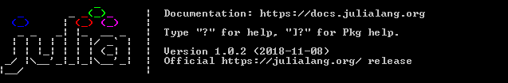

# Aprende un lenguaje de programación en un día (ejercicio voluntario para subir nota).

## Miembros del grupo

Escribe aquí los miembros del grupo. El primero es el representante o encargado.

* Pedro Torres Barba (Líder)
* Jorge García Molina
* Rafaél Aragón Rodríguez

## Lenguaje de programación



* JULIA

## Información sobre el lenguaje

La página oficial del lenguaje es [julia.org](https://julialang.org)

Julia es un lenguaje de programación multiplataforma y multiparadigma de tipado dinámico, alto nivel y alto desempeño para la computación genérica, técnica y científica, con una sintaxis que es familiar para los usuarios de otros entornos de computación técnica y científica

## Herramientas de desarrollo

Se puede programar con Visual Studio Code si le instalas el Plugin de Julia.

## Poniendo en práctica el lenguaje

### 1. ¡Hola mundo!

Realiza un programa que muestre por pantalla la frase **¡Hola Mundo!**.

```julia
println("¡Hola Mundo!")
```


### 2. Pirámide

Dada una altura introducida por el usuario, realiza un programa que pinte una pirámide a base de asteriscos con la altura indicada.

```julia
print("Introduce la altura de la pirámide: ")
alt = readline(STDIN)
altura = parse(Int, alt)
base = 1
largo = 1
espacio = (altura - 1)
while base <= altura
    for i = 0:espacio
        print(" ")
    end

    for i = 1:largo
        print("*")
    end

    println("")
    base = base + 1
    espacio = espacio - 1
    largo = largo + 2
end
```

### 3. Arrays y números aleatorios

Realiza un programa que rellene un array (o una estructura similar) con 20 números enteros aleatorios entre 1 y 100 y que seguidamente los muestre por pantalla. A continuación, se deben pasar los números primos a las primeras posiciones del array y los no primos a las posiciones restantes. Muestra finalmente el array resultado.


